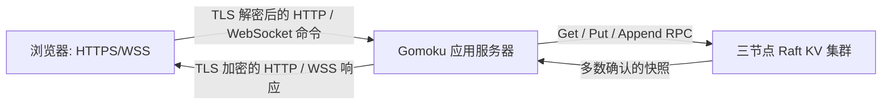
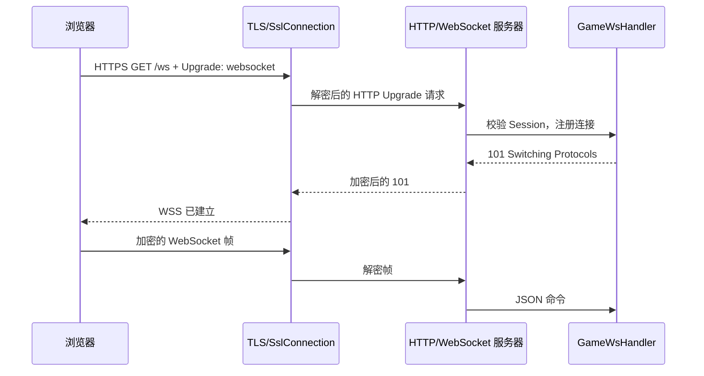
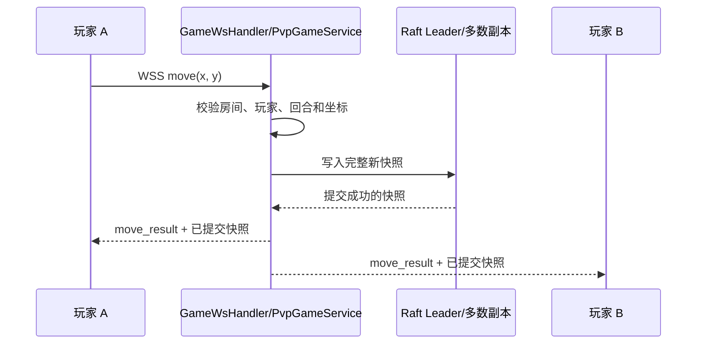

# 五子棋数据流复习

本项目有两个边界：浏览器只与应用服务器通信；应用服务器才会访问 Raft KV。浏览器不会直接连接 Raft。

## 1. 连接与登录

1. 浏览器访问 HTTP `8080` 时，重定向监听器返回 HTTPS `8443` 地址。它不创建会话，也不处理业务。
2. 浏览器与 `8443` 完成 TLS 握手。本地服务器证书由本地 CA 签发，SAN 为 `localhost`、`127.0.0.1`。
3. HTTPS 请求进入 Muduo TCP 回调，`SslConnection` 将密文解密为 HTTP 字节流，`HttpContext` 解析请求，随后依次进入中间件、路由和处理器。
4. 登录处理器查询 MySQL；成功后将 `userId`、用户名和登录标记写入内存 Session，并通过 `Set-Cookie` 返回会话 ID。TLS 模式下 Cookie 带 `Secure`、`HttpOnly`、`SameSite=Lax`。

会话是单个应用进程内存状态。普通窗口与无痕窗口各有独立 Cookie 存储，因此可在一台机器上同时登录两个账号。

## 2. WebSocket 建连与消息传输

关键点是 TLS 不在 HTTP 升级后停止：升级后的 WebSocket 输入帧仍先由 `SslConnection` 解密，输出帧也由
`HttpServer` 的传输回调加密。Pong、Close、PVP 通知和聊天室消息都使用同一路径，避免将明文帧写到 TLS
连接上。

## 3. 匹配与对局创建

1. 双方 WSS 客户端发送 `match_request`。
2. `GameWsHandler` 维护单进程匹配池；第二名玩家到达时配对。
3. `PvpGameService` 创建包含双方用户 ID、15x15 棋盘、当前回合、落子数和结束状态的完整房间快照。
4. 快照和活跃房间索引写入 Raft。只有写入成功，应用才向两个 WSS 连接发送 `match_found`。

## 4. 落子提交与广播

应用服务器不会先改本地棋盘再广播。它先生成候选状态、写入 Raft、接收已提交快照，再替换本地房间缓存并
广播。因此两个客户端看到的棋盘来自同一次 Raft 提交。

## 5. 失败、Leader 切换和应用重启

- Leader 不可用或提交超时：应用保留旧的本地房间状态，向请求方发送 `raft_unavailable`。前端请求最新
  已提交快照，不自动重放落子。
- Leader 进程终止但仍有多数节点：Raft 选出新 Leader；后续提交继续，应用层无需切换浏览器连接。
- 应用进程重启：启动时读取 Raft 的活跃房间索引和每个完整快照，恢复本地房间、棋盘和当前回合；浏览器
  重新建立 WSS 后请求房间状态。

## 6. 设计边界

- 一个应用进程是 PVP 的唯一写入者。若运行多个应用进程，它们会拥有不同的会话、匹配队列和实时连接，且
  可能并发覆盖同一房间快照。
- HTTP `8080` 只负责跳转，HTTPS/WSS `8443` 才承载业务，避免账号和对局数据走明文链路。
- TLS 仅覆盖浏览器到应用服务器；当前 Raft RPC 运行在本机演示网络，未额外启用 TLS。
